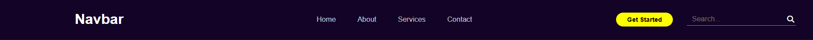
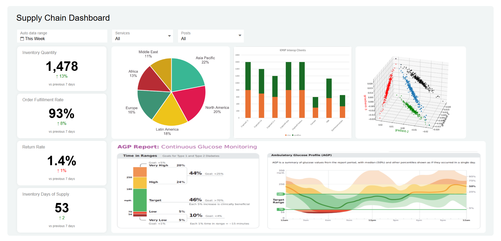
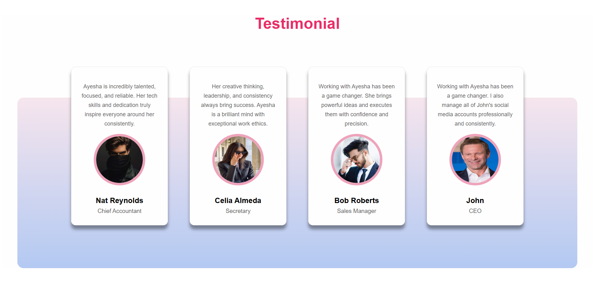
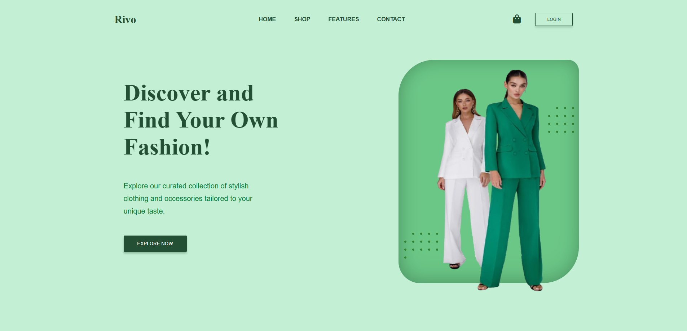
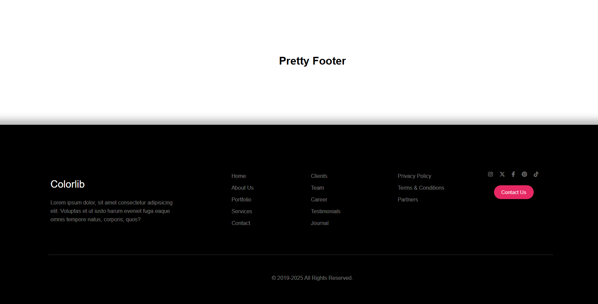
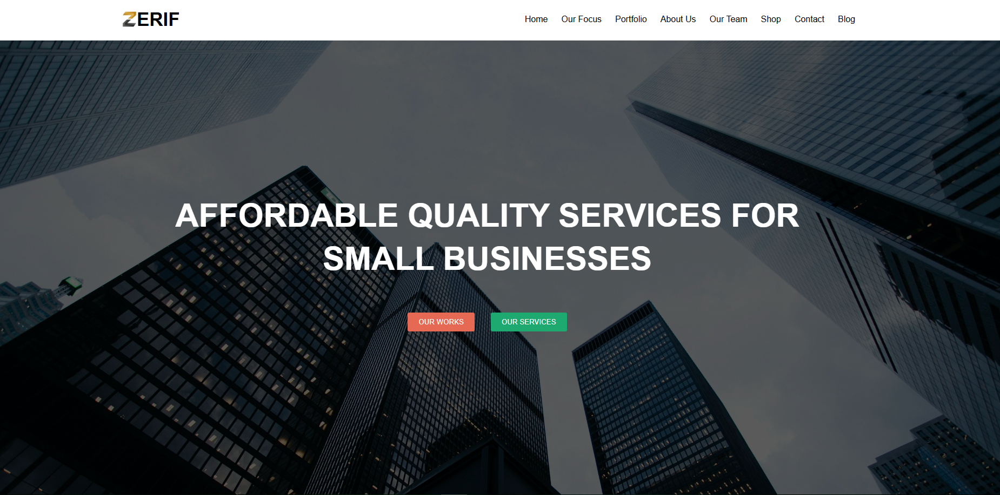

<div align="center">
  

# 🧩 ZeroCode SaaS Builder

**The Ultimate Drag & Drop Web App Creator — Powered by HTML, CSS, and JavaScript**

</div>

---

## 🌐 Introduction

**ZeroCode SaaS Builder** is more than just a drag-and-drop tool — it’s your gateway to building fully responsive, clean, and professional-looking SaaS-style web layouts **without writing a single line of backend code**. Whether you’re a beginner, a student, or a fast-prototyping enthusiast, this tool empowers you to **build like a developer** with **zero coding experience**.

---

## 💡 Why ZeroCode?

* 🔧 100% Client-side — Runs in the browser with zero setup
* 🎨 Fully customizable UI blocks with live preview
* 📦 Reusable HTML components for rapid design
* 💾 Local storage integration to save and load layouts
* 📤 Scalable with Firebase or Node.js for full-stack upgrades
* 🧠 Great for students, freelancers, MVP builders, and educators

---

## ✨ Core Features

* 🧩 **Drag-and-Drop Interface** – Intuitive and smooth
* 📄 **Component Library** – Login forms, pricing tables, dashboards, and more
* 🖥️ **Real-time Canvas Preview** – Live output as you build
* 💾 **Save/Load Layout** – Store your layout in `localStorage`
* 📤 **Export Feature** – Optional download/export to HTML
* 📱 **Mobile Responsive** – Clean and adaptive structure
* ⚙️ **Easily Extendable** – Add your own blocks in seconds

---

## 🖼️ Screenshot Gallery (Preview of All 16 Buttons)















---

## 📁 Project Structure

```
zerocode-saas-builder/
├── index.html            → Main page
├── style.css             → All styles
├── script.js             → Drag-drop + logic
└── components/           → UI components
    ├── login.html
    ├── pricing.html
    ├── dashboard.html
    ├── faq.html
    ├── hero.html
    ├── testimonials.html
    ├── features.html
    ├── contact.html
    ├── services.html
    ├── portfolio.html
    ├── navbar.html
    ├── footer.html
    ├── gallery.html
    ├── stats.html
    ├── newsletter.html
    └── sidebar.html
```

> You can **add unlimited components** in the `components/` folder — they’ll all load dynamically via JavaScript.

---

## 🔥 Getting Started (Installation)

1. 📥 **Clone or Download** the repository:

```bash
git clone https://github.com/your-username/zerocode-saas-builder.git
```

2. 💻 Open the folder in VS Code or any editor.

3. 🌐 Open `index.html` in your browser to begin.

That’s it. You’re now ready to build!

---

## 🧑‍🎓 How to Use It

1. Drag any UI block (Login, Pricing, Dashboard, etc.) from the top toolbar.
2. Drop it onto the main canvas.
3. Instantly preview your layout.
4. Use **Save** button to store layout.
5. Reload anytime with the **Load** button.
6. Add more `.html` components inside the `components/` folder to expand your library.

---

## 🧱 Built-in Components

Here are just a few sample blocks (you can create many more!):

### 🔐 login.html

```html
<form>
  <h3>Login</h3>
  <input type="email" placeholder="Email"><br>
  <input type="password" placeholder="Password"><br>
  <button>Login</button>
</form>
```
### 💵 pricing.html

```html
<div>
  <h3>Pricing</h3>
  <ul>
    <li>Basic - $10</li>
    <li>Pro - $30</li>
  </ul>
</div>
```

### 📊 dashboard.html

```html
<div>
  <h3>User Dashboard</h3>
  <p>Welcome, user123!</p>
</div>
```

> You can include FAQ sections, footers, navbars, hero sections, contact forms — anything reusable.

---

## 🧪 Future Upgrades (Advanced Ideas)

* 🔐 Firebase authentication
* 📤 Export HTML file with `canvas.innerHTML`
* ♻️ Undo/redo action system
* 🌐 Shareable layout link (via JSON blob)
* 🌈 Component style editor (like changing colors/fonts)
* 📁 Multi-page layout builder

---

## 📆 Development Timeline

* 🗓️ Built in just **2 weeks**
* ✨ Clean code structure
* 🔧 Modular components
* 📈 Easy scalability
* 👩‍💻 Perfect for MVPs, learning, portfolios, and freelance demos

---

## 👤 Author

**Made by [Ayesha](https://github.com/ayeshadatascientist9)**
🚀 Tech visionary, data scientist, and drag-n-drop UI enthusiast.

---

## ⭐ How to Support

If you love the project:

* ⭐ Star this repo on GitHub
* 🍴 Fork and improve it
* 🛠 Use it in your portfolio or startup
* 📢 Share with friends or learners
* 💬 Submit ideas, bugs, or requests via GitHub issues

> **"Zero coding, infinite creativity – that’s the ZeroCode vision."**
